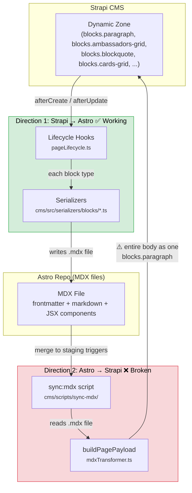
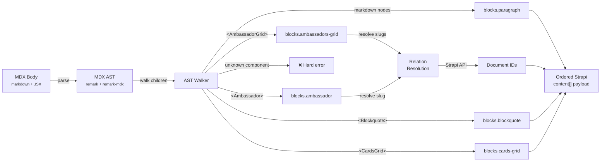

# MDX ↔ Strapi Reverse Sync: The Problem Explained

## Summary

Content on this site is managed in two places: **Strapi CMS** (used by editors through a web UI) and **MDX files** in the Astro repository (used for rendering, and editable by developers and translators). Changes made in either place need to be synced to the other.

The **Strapi → MDX** direction works correctly. The **MDX → Strapi** direction is broken — it destroys block structure and relations, making round-trips lossy. This document explains the problem with concrete examples, proposes a fix (AST-based parsing, "Approach A" from [Issue #89](https://github.com/interledger/interledger.org-v5/issues/89)), details the implementation plan, and explains why alternative approaches were rejected.

---

## The problem, by example



**The problem:** Direction 1 correctly converts each Strapi block into its matching JSX component. Direction 2 does the opposite badly — it dumps the entire MDX body (markdown + JSX) into a single `blocks.paragraph`, destroying block structure and relations.

**The fix (Approach A):** Replace `buildPagePayload`'s naive single-paragraph handling with an MDX AST parser that reconstructs the original block structure:



Each JSX component in the MDX maps to a specific Strapi block type via a dedicated handler function. Markdown text between components becomes `blocks.paragraph` entries. Block order is preserved. Unrecognized components trigger an error rather than silent data loss.

### Direction 1: Strapi → Astro (works correctly)

An editor builds a page in Strapi's UI. Strapi lets editors compose pages from reusable building blocks — a paragraph of text, an ambassador grid, a blockquote, etc. (Strapi calls this a "dynamic zone": an ordered list of typed content blocks.)

Say the `about-us` page has three blocks:

| Block in Strapi | `__component` |
|---|---|
| A paragraph of text | `blocks.paragraph` |
| An ambassador grid picking 2 people | `blocks.ambassadors-grid` |
| A blockquote with attribution | `blocks.blockquote` |

The serializers in `cms/src/serializers/blocks/` convert each Strapi block into proper JSX. The resulting MDX file would look like:

```mdx
---
slug: 'about-us'
title: 'About Us'
heroTitle: 'Building equity and inclusion'
---

The Interledger Foundation is a mission-driven nonprofit...

<AmbassadorGrid heading="Meet our ambassadors" slugs={["andria-barret","caroline-sinders"]} />

<Blockquote source="**Jane Doe**, Acme Corp">
  Interledger changed how we think about open payments.
</Blockquote>
```

Each Strapi block type has its own serializer (e.g. `ambassador.serializer.ts`, `blockquote.serializer.ts`). This direction works fine.

### Direction 2: Astro → Strapi (the broken one)

Now suppose that MDX file gets edited by a translator or a developer in a PR, and the `sync:mdx` script runs to push changes back into Strapi.

Look at what `buildPagePayload` in `cms/scripts/sync-mdx/mdxTransformer.ts` currently does — it takes the **entire body** and stuffs it into a single paragraph:

```ts
data.content = [
  {
    __component: 'blocks.paragraph',
    content: mdx.content  // the ENTIRE body as one string
  }
]
```

So Strapi receives this:

```json
[
  {
    "__component": "blocks.paragraph",
    "content": "The Interledger...\n\n<AmbassadorGrid heading=\"Meet our ambassadors\" slugs={[\"andria-barret\",\"caroline-sinders\"]} />\n\n<Blockquote source=\"**Jane Doe**, Acme Corp\">\n  Interledger changed...\n</Blockquote>"
  }
]
```

The structured blocks are **gone**:

- The ambassador relation (which in Strapi is a `oneToMany` relation to actual ambassador entries, defined in `cms/src/components/blocks/ambassadors-grid.json`) is just a raw string `slugs={["andria-barret",...]}` — Strapi has no idea what to do with that.
- The blockquote is no longer a separate `blocks.blockquote` component — it's just text inside a paragraph.
- The editor can no longer see or manipulate the ambassador grid or blockquote as separate blocks in the Strapi UI.

And then when Strapi → Astro fires again, it serializes that single giant paragraph block back out — now the JSX is treated as literal richtext content, not as components. **The round-trip is lossy.**

---

## The fix: parse the MDX body into structured blocks (Approach A)

Instead of blindly wrapping everything in one `blocks.paragraph`, the sync script would parse the MDX into a syntax tree (using standard libraries that already exist in the project), recognize each JSX component, extract its props, resolve relations (like ambassador slugs → Strapi document IDs), and produce the correct structured payload:

```json
[
  {
    "__component": "blocks.paragraph",
    "content": "The Interledger Foundation is a mission-driven nonprofit..."
  },
  {
    "__component": "blocks.ambassadors-grid",
    "heading": "Meet our ambassadors",
    "ambassadors": ["<docId-andria>", "<docId-caroline>"]
  },
  {
    "__component": "blocks.blockquote",
    "quote": "Interledger changed how we think about open payments.",
    "source": "**Jane Doe**, Acme Corp"
  }
]
```

Each JSX component in the MDX body maps to a specific Strapi block type. Markdown text between components maps to `blocks.paragraph`. Order is preserved.

**Note:** The current MDX files (like `src/content/foundation-pages/about-us.mdx`) don't contain JSX components yet — editors haven't started using those block types. This problem will surface as soon as they do.

---

## Architecture overview

With the problem established, here is how the two sync directions fit into the codebase:

---

## Development effort: building the MDX → Strapi parser

At first glance, "building a parser" sounds like a big undertaking. In practice, most of the heavy lifting is already done by existing libraries, and the project already has the working inverse (Strapi → MDX serializers). The actual new code is a set of small, independent mapping functions — roughly the same effort as the serializers the team has already written.

### You're not building a parser — you're writing mappers

The real parsing — turning MDX text into a structured syntax tree — is handled entirely by two libraries: `remark` and `remark-mdx`. Both are already installed in the workspace (pulled in by `@astrojs/mdx`). The only step is adding them as explicit dependencies in `cms/package.json`.

Parsing an MDX body into a usable tree is two lines:

```ts
import { remark } from 'remark'
import remarkMdx from 'remark-mdx'

const tree = remark().use(remarkMdx).parse(mdxBody)
```

After this, `tree.children` is a flat list of nodes. Each node is either a standard markdown element (paragraph, heading, list) or an `mdxJsxFlowElement` — a JSX component with its name and attributes already extracted into structured objects. No regular expressions, no string manipulation, no custom grammar.

### What the team actually needs to write

**1. A top-level walker** — a single function that iterates through `tree.children` and sorts nodes into two buckets:

- Markdown nodes → accumulate and serialize as `blocks.paragraph`
- JSX nodes → dispatch to the appropriate component handler

This is maybe 30-40 lines of code.

**2. One handler function per block type** — each one reads attributes from a JSX AST node and returns a Strapi block object. These are the mirror image of the serializers that already exist.

For example, the existing `ambassadors-grid.serializer.ts` converts Strapi data *to* JSX:

```ts
// Strapi → JSX (already exists)
`<AmbassadorGrid heading="${heading}" slugs={[${slugs}]} />`
```

The new handler does the reverse — JSX AST *to* Strapi data:

```ts
// JSX → Strapi (new code needed)
function handleAmbassadorsGrid(node) {
  return {
    __component: 'blocks.ambassadors-grid',
    heading: getStringAttr(node, 'heading'),
    ambassadors: getArrayAttr(node, 'slugs')
  }
}
```

Each handler is roughly 10-20 lines. There are about 10 block types in total.

**3. A small set of attribute extraction helpers** — utility functions that read typed values from JSX AST attribute nodes. These are shared across all handlers:

- `getStringAttr(node, name)` — reads a string literal attribute
- `getNumberAttr(node, name)` — reads a numeric literal attribute
- `getArrayAttr(node, name)` — reads an array-of-strings expression like `{["a","b"]}`
- `getChildrenText(node)` — extracts text content from JSX children (for `<Blockquote>`)

These helpers total maybe 40-60 lines, written once.

**4. Relation resolution** — converting slug strings (like `"andria-barret"`) to Strapi document IDs. The `StrapiClient` already exists in `cms/scripts/sync-mdx/strapiClient.ts`; this just needs a `findBySlug` query added to it.

### Container blocks (CardsGrid, Carousel) are slightly more work

Most blocks are self-closing (`<Ambassador ... />`) or have simple text children (`<Blockquote>text</Blockquote>`). Three blocks have nested JSX children:

- `<CardsGrid>` contains `<Card>` elements
- `<CardLinksGrid>` contains `<CardLink>` elements
- `<Carousel>` contains `<CarouselItem>` elements

For these, the handler walks `node.children` to extract each child element's attributes. This is the same attribute extraction as above, just one level deeper. The AST already has these as nested `mdxJsxFlowElement` nodes — no extra parsing required. Each container handler is maybe 25-35 lines.

### Strict mode: fail loudly on anything unexpected

A key design decision from the RFC: the parser should **hard-fail** on anything it doesn't recognize. This keeps the implementation simple and avoids silent data corruption:

- Unknown component name → error with file and line reference
- Dynamic JS expression in a prop (variable, function call, template literal) → error
- Missing required prop → error
- Slug that doesn't match any Strapi entry → error

This means the parser only needs to handle the known, controlled vocabulary of components and static prop values. No need to handle arbitrary JSX or runtime expressions.

### Rough size estimate

| Piece | Estimated lines | Notes |
|---|---|---|
| Top-level AST walker | ~40 | Iterate children, dispatch to handlers |
| Attribute extraction helpers | ~50 | Shared utilities, written once |
| Simple block handlers (×7) | ~100 | Ambassador, AmbassadorGrid, Blockquote, Paragraph, CtaBanner, CalloutText, ImageRow |
| Container block handlers (×3) | ~90 | CardsGrid, CardLinksGrid, Carousel |
| Relation resolution | ~30 | findBySlug wrapper |
| Error handling / validation | ~40 | Strict-mode checks |
| **Total new code** | **~350 lines** | |
| Tests | ~300-400 | One test per block type + edge cases |

For context, the existing serializers in `cms/src/serializers/blocks/` total around 250 lines. The parser is comparable in size — roughly the same set of mappings, just running in the other direction.

### What already exists and can be reused

| What | Where | Status |
|---|---|---|
| MDX parsing to AST | `remark` + `remark-mdx` | Installed in workspace, add to `cms/package.json` |
| JSX AST node types | `mdast-util-mdx-jsx` | Already installed |
| Frontmatter extraction | `gray-matter` in `scan.ts` | Already used by sync script |
| Strapi API client | `cms/scripts/sync-mdx/strapiClient.ts` | Already exists |
| Block type definitions | `cms/src/components/blocks/*.json` | Already defined |
| Serializers (the inverse) | `cms/src/serializers/blocks/*.ts` | Reference for prop names and shapes |
| Test infrastructure | `vitest` in `cms/package.json` | Already configured |

---

## Implementation Plan

This plan is structured in phases that each produce tested, working code before moving on. Every phase ends with a green test suite. The aim is to build confidence incrementally — nothing gets wired into the live sync pipeline until the individual pieces are proven.

The existing test setup (`vitest`, `test-utils.ts`, mock patterns in `mdxTransformer.test.ts` and `syncOperations.test.ts`) is reused throughout.

---

### Phase 0: Setup (half a day)

**Goal:** Get the parsing libraries available in the CMS workspace and verify the AST shape.

**Tasks:**
1. Add `remark` and `remark-mdx` as dependencies in `cms/package.json`
2. Run `pnpm install` in the CMS workspace
3. Write a small exploratory test that parses a sample MDX string and logs the AST — confirm that JSX elements appear as `mdxJsxFlowElement` nodes with `.name` and `.attributes`

**Test:**
```ts
it('parses MDX with JSX into expected AST node types', () => {
  const tree = remark().use(remarkMdx).parse('# Hello\n\n<Ambassador slug="test" />')
  const types = tree.children.map(n => n.type)
  expect(types).toEqual(['heading', 'mdxJsxFlowElement'])
})
```

**Deliverable:** Developer familiarity with the AST structure. No production code yet.

---

### Phase 1: Attribute extraction helpers (1 day)

**Goal:** Build and fully test the shared utility functions that read typed values from JSX AST attribute nodes.

**File:** `cms/scripts/sync-mdx/jsxExtract.ts` (new)  
**Test file:** `cms/scripts/sync-mdx/jsxExtract.test.ts` (new)

**Functions to implement:**

| Helper | Purpose | Example input → output |
|---|---|---|
| `getStringAttr(node, name)` | Read a string literal attribute | `heading="Hello"` → `"Hello"` |
| `getNumberAttr(node, name)` | Read a numeric literal attribute | `columns={3}` → `3` |
| `getBooleanAttr(node, name)` | Read a boolean attribute | `showLinks={false}` → `false` |
| `getStringArrayAttr(node, name)` | Read an array-of-strings expression | `slugs={["a","b"]}` → `["a","b"]` |
| `getChildrenText(node)` | Serialize JSX children back to markdown text | `<Blockquote>Some **bold** text</Blockquote>` → `"Some **bold** text"` |

**Tests per helper (minimum):**
- Happy path with valid input
- Missing attribute returns `undefined` (or default)
- Wrong type (e.g. expression instead of literal for `getStringAttr`) → throws descriptive error with attribute name
- Dynamic/unsupported expression → throws with message like `"Unsupported expression in prop 'slugs': only static literals are allowed"`

**Sample tests:**
```ts
describe('getStringAttr', () => {
  it('extracts a string literal attribute', () => { ... })
  it('returns undefined when attribute is absent', () => { ... })
  it('throws on expression attribute (variable reference)', () => { ... })
})

describe('getStringArrayAttr', () => {
  it('extracts an array of string literals', () => { ... })
  it('throws on non-array expression', () => { ... })
  it('throws when array contains non-string elements', () => { ... })
})

describe('getChildrenText', () => {
  it('extracts plain text children', () => { ... })
  it('extracts markdown-formatted children', () => { ... })
  it('returns empty string for self-closing elements', () => { ... })
})
```

**Deliverable:** A tested, self-contained utility module with no dependencies on Strapi or the sync pipeline. ~50 lines of code, ~80-100 lines of tests.

---

### Phase 2: Simple block handlers (1-2 days)

**Goal:** Implement handlers for all non-container block types — the ones that are self-closing or have simple text children.

**File:** `cms/scripts/sync-mdx/blockParsers.ts` (new)  
**Test file:** `cms/scripts/sync-mdx/blockParsers.test.ts` (new)

**Handlers to implement:**

| Handler | Component | Key props |
|---|---|---|
| `parseAmbassador` | `<Ambassador>` | `slug` (string) |
| `parseAmbassadorsGrid` | `<AmbassadorGrid>` | `heading` (string), `slugs` (string array) |
| `parseBlockquote` | `<Blockquote>` | `source` (string attr), children (text) |
| `parseParagraph` | _(markdown nodes)_ | Serialize markdown back to string |
| `parseCalloutText` | `<CalloutText>` | `content` (string), `type` (string) |
| `parseCtaBanner` | `<CtaBanner>` | `heading` (string), `description`, `buttonText`, `buttonLink` |
| `parseImageRow` | `<ImageRow>` | Image-related attributes |

Each handler:
1. Takes an `mdxJsxFlowElement` AST node
2. Returns a Strapi block object (e.g. `{ __component: 'blocks.blockquote', quote: '...', source: '...' }`)
3. Throws on missing required props or unsupported expression types

**Testing approach:** For each handler, write tests using real MDX snippets parsed through `remark` + `remark-mdx`. This ensures the tests validate the full path from MDX text to Strapi block object.

```ts
describe('parseAmbassadorsGrid', () => {
  it('extracts heading and slugs from a valid element', () => {
    const tree = parse('<AmbassadorGrid heading="Our team" slugs={["alice","bob"]} />')
    const node = tree.children[0] // mdxJsxFlowElement
    const block = parseAmbassadorsGrid(node)
    expect(block).toEqual({
      __component: 'blocks.ambassadors-grid',
      heading: 'Our team',
      ambassadors: ['alice', 'bob']  // slugs, not yet resolved to IDs
    })
  })

  it('handles missing optional heading', () => { ... })
  it('throws when slugs is a variable reference', () => { ... })
  it('throws when slugs contains non-string values', () => { ... })
})

describe('parseBlockquote', () => {
  it('extracts source and children text', () => {
    const tree = parse('<Blockquote source="**Jane**, Acme">Great work.</Blockquote>')
    const block = parseBlockquote(tree.children[0])
    expect(block).toEqual({
      __component: 'blocks.blockquote',
      quote: 'Great work.',
      source: '**Jane**, Acme'
    })
  })

  it('handles multiline children', () => { ... })
  it('handles children with markdown formatting', () => { ... })
})
```

**Deliverable:** All simple block handlers tested in isolation. No Strapi calls, no side effects. ~100 lines of code, ~150-200 lines of tests.

---

### Phase 3: Container block handlers (1 day)

**Goal:** Implement handlers for the three block types that contain child JSX elements.

**Same files as Phase 2** (extend `blockParsers.ts` and `blockParsers.test.ts`).

**Handlers to implement:**

| Handler | Outer component | Child component | Key child props |
|---|---|---|---|
| `parseCardsGrid` | `<CardsGrid>` | `<Card>` | `title`, `description`, `link`, `linkText`, `icon` |
| `parseCardLinksGrid` | `<CardLinksGrid>` | `<CardLink>` | `title`, `description`, `href`, `openInNewTab` |
| `parseCarousel` | `<Carousel>` | `<CarouselItem>` | `title`, `description`, `image`, `link` |

Each handler:
1. Reads attributes from the outer element (e.g. `columns`, `heading`)
2. Iterates `node.children` to find child JSX elements
3. Extracts attributes from each child element
4. Returns the nested Strapi structure

**Tests:**
```ts
describe('parseCardsGrid', () => {
  it('extracts grid with multiple cards', () => {
    const mdx = `<CardsGrid columns={3}>
      <Card title="Card 1" link="/one">Description one</Card>
      <Card title="Card 2" link="/two">Description two</Card>
    </CardsGrid>`
    const block = parseCardsGrid(parse(mdx).children[0])
    expect(block).toEqual({
      __component: 'blocks.cards-grid',
      columns: 3,
      cards: [
        { title: 'Card 1', link: '/one', description: 'Description one' },
        { title: 'Card 2', link: '/two', description: 'Description two' }
      ]
    })
  })

  it('handles empty grid', () => { ... })
  it('ignores non-Card children (whitespace text nodes)', () => { ... })
  it('throws on unrecognized child component', () => { ... })
})
```

**Deliverable:** All block handlers complete and tested. ~90 lines of code, ~100-150 lines of tests.

---

### Phase 4: The AST walker (1 day)

**Goal:** Build the top-level function that walks `tree.children`, dispatches to handlers, and produces the final ordered block array.

**File:** `cms/scripts/sync-mdx/mdxBlockParser.ts` (new)  
**Test file:** `cms/scripts/sync-mdx/mdxBlockParser.test.ts` (new)

**Function signature:**
```ts
function parseMdxToBlocks(mdxBody: string): StrapiBlock[]
```

**Responsibilities:**
1. Parse `mdxBody` with `remark` + `remark-mdx`
2. Walk `tree.children` in order
3. Accumulate consecutive markdown nodes into `blocks.paragraph` entries (serialize back to markdown string)
4. Dispatch recognized JSX elements to the appropriate handler from Phase 2/3
5. Throw on unrecognized JSX component names (strict mode)
6. Return the ordered array of Strapi blocks

**Tests — full MDX documents:**
```ts
describe('parseMdxToBlocks', () => {
  it('converts a mixed MDX body into ordered Strapi blocks', () => {
    const mdx = `
Some intro paragraph.

<AmbassadorGrid heading="Our team" slugs={["alice","bob"]} />

More text here.

<Blockquote source="**Jane**">A great quote.</Blockquote>
    `
    const blocks = parseMdxToBlocks(mdx)
    expect(blocks).toEqual([
      { __component: 'blocks.paragraph', content: 'Some intro paragraph.' },
      { __component: 'blocks.ambassadors-grid', heading: 'Our team', ambassadors: ['alice', 'bob'] },
      { __component: 'blocks.paragraph', content: 'More text here.' },
      { __component: 'blocks.blockquote', quote: 'A great quote.', source: '**Jane**' }
    ])
  })

  it('handles MDX with only text (no JSX)', () => { ... })
  it('handles MDX with only JSX (no text)', () => { ... })
  it('handles adjacent JSX components with no text between them', () => { ... })
  it('throws on unrecognized component', () => { ... })
  it('handles complex document with all block types', () => { ... })
})
```

**Deliverable:** End-to-end MDX-to-blocks conversion tested with realistic documents. No Strapi calls yet — slug strings are left as-is. ~40 lines of code, ~100-150 lines of tests.

---

### Phase 5: Relation resolution (half a day)

**Goal:** Add the step that converts slug strings to Strapi document IDs.

**File:** extend `cms/scripts/sync-mdx/mdxBlockParser.ts`  
**Test file:** extend `cms/scripts/sync-mdx/mdxBlockParser.test.ts`

**Function:**
```ts
async function resolveBlockRelations(
  blocks: StrapiBlock[],
  strapi: StrapiClient
): Promise<StrapiBlock[]>
```

**Responsibilities:**
1. Walk the block array
2. For `blocks.ambassador`: resolve `ambassador` slug → document ID via `strapi.findBySlug('ambassadors', slug)`
3. For `blocks.ambassadors-grid`: resolve each slug in `ambassadors` array
4. Throw on any slug that doesn't resolve (strict mode — no silent data loss)

**Tests:** Use a mock `StrapiClient` (same pattern as `syncOperations.test.ts`):
```ts
describe('resolveBlockRelations', () => {
  it('resolves ambassador slugs to document IDs', async () => {
    const mockStrapi = createMockStrapi()
    mockStrapi.findBySlug
      .mockResolvedValueOnce({ documentId: 'doc-alice', slug: 'alice' })
      .mockResolvedValueOnce({ documentId: 'doc-bob', slug: 'bob' })

    const blocks = [
      { __component: 'blocks.ambassadors-grid', heading: 'Team', ambassadors: ['alice', 'bob'] }
    ]

    const resolved = await resolveBlockRelations(blocks, mockStrapi)
    expect(resolved[0].ambassadors).toEqual(['doc-alice', 'doc-bob'])
  })

  it('throws when a slug cannot be resolved', async () => { ... })
  it('passes through blocks with no relations unchanged', async () => { ... })
})
```

**Deliverable:** Relation resolution tested against mocked Strapi. ~30 lines of code, ~50-80 lines of tests.

---

### Phase 6: Integration into the sync pipeline (half a day)

**Goal:** Replace the single-paragraph content handling in `buildPagePayload` with the new parser.

**File:** `cms/scripts/sync-mdx/mdxTransformer.ts` (modify existing)

**Change:** Replace the current content handling block:
```ts
// BEFORE: everything as one paragraph
data.content = [{ __component: 'blocks.paragraph', content: mdx.content }]
```

with:
```ts
// AFTER: parse MDX body into structured blocks
const blocks = parseMdxToBlocks(mdxBody)
data.content = await resolveBlockRelations(blocks, strapi)
```

This also requires updating `buildPagePayload` to accept a `StrapiClient` parameter (it currently doesn't need one because it doesn't resolve relations).

**Note:** The `buildPayload` function signature in `config.ts` already passes `strapi` — it's just not forwarded to `buildPagePayload` today. This is a one-line wiring change.

**Tests:** Update existing tests in `mdxTransformer.test.ts`:
- Existing tests for plain-text MDX pages should still pass (the parser treats text-only MDX as a single `blocks.paragraph`)
- Add new tests for MDX with JSX components
- Add integration test that validates the full path: MDX string → `buildPagePayload` → structured blocks with resolved relations

**Deliverable:** The sync pipeline uses the new parser. All existing tests still pass.

---

### Phase 7: Round-trip validation (1 day)

**Goal:** Prove that content survives a full Strapi → MDX → Strapi round-trip.

**Test file:** `cms/scripts/sync-mdx/roundtrip.test.ts` (new)

**Approach:** Use the existing serializers and the new parser together:
1. Start with a Strapi content array (blocks with `__component` fields)
2. Serialize it to MDX body using `serializeContent` from `cms/src/serializers/blocks/index.ts`
3. Parse it back to blocks using `parseMdxToBlocks`
4. Compare the result to the original (ignoring relation ID resolution)

```ts
describe('round-trip: serialize then parse', () => {
  it('ambassador grid survives round-trip', () => {
    const original = {
      __component: 'blocks.ambassadors-grid',
      heading: 'Our team',
      ambassadors: [{ slug: 'alice' }, { slug: 'bob' }]
    }
    const mdx = serializeAmbassadorsGrid(original)
    const parsed = parseMdxToBlocks(mdx)
    expect(parsed[0]).toMatchObject({
      __component: 'blocks.ambassadors-grid',
      heading: 'Our team',
      ambassadors: ['alice', 'bob']
    })
  })

  it('full page with mixed blocks survives round-trip', () => { ... })
  it('blockquote with markdown source survives round-trip', () => { ... })
  it('cards grid with multiple cards survives round-trip', () => { ... })
})
```

This is the most important test phase — it validates that the serializers and parser are true inverses of each other.

**Deliverable:** Proven round-trip fidelity for all block types.

---

### Phase summary

| Phase | What | New code | Tests | Duration |
|---|---|---|---|---|
| 0 | Setup + AST exploration | 0 | ~10 lines | Half day |
| 1 | Attribute extraction helpers | ~50 lines | ~100 lines | 1 day |
| 2 | Simple block handlers | ~100 lines | ~200 lines | 1-2 days |
| 3 | Container block handlers | ~90 lines | ~150 lines | 1 day |
| 4 | AST walker | ~40 lines | ~150 lines | 1 day |
| 5 | Relation resolution | ~30 lines | ~80 lines | Half day |
| 6 | Pipeline integration | ~20 lines | ~50 lines | Half day |
| 7 | Round-trip validation | 0 | ~150 lines | 1 day |
| **Total** | | **~330 lines** | **~890 lines** | **~6-7 days** |

### Key testing principles

1. **Test from MDX text, not AST objects.** Every handler test should start with an MDX string, parse it, then validate the output. This catches parser assumptions that don't match real MDX syntax.

2. **Test the error paths.** Every handler should have at least one test for "throws on unsupported expression" and "throws on missing required prop." Strict-mode errors are the safety net.

3. **Round-trip tests are the acceptance criteria.** If `serialize → parse` gives back the same data, the implementation is correct by construction.

4. **Each phase is independently mergeable.** Phases 1-5 produce pure functions with no side effects. They can be reviewed and merged without affecting the live sync pipeline. Phase 6 is the only change that touches production code.

---

## Why we rejected the alternative approaches

Several lighter-weight alternatives were considered before settling on the AST-based parser (Approach A). They were all rejected for the same core reasons.

### Our non-negotiable requirements

1. **MDX files must remain standard MDX.** The `.mdx` files in this repo are the canonical content format. They must be valid, idiomatic MDX that any MDX-aware tool can process — editors, linters, translation platforms, future CMS migrations, or tools that don't exist yet. Anything that adds non-standard syntax or metadata to the MDX files reduces their portability and ties us to our own tooling.

2. **Bidirectional sync with high fidelity is mandatory.** The project requires that content can be authored and edited in either Strapi or the MDX files, and synced in both directions without data loss. If the reverse sync (MDX → Strapi) can't faithfully reconstruct structured blocks, we fail the core requirement. Maintaining a custom set of block types with their specific properties is an acceptable cost — that's just the mapping layer between two known formats.

3. **No "magic" that external tools won't understand.** Any approach that embeds hidden metadata in the MDX (comments, custom attributes, frontmatter mirrors) creates a proprietary format. External tools — translation agencies, markdown editors, automated content pipelines — will not know to preserve or update this metadata. Silent drift, data loss, or corruption becomes inevitable once anyone outside our team touches the files.

### Rejected alternatives

**"Don't reverse-sync components" (ownership boundary)**

Skip component blocks during MDX → Strapi sync; only update paragraph text. This avoids parsing entirely but violates requirement 2 — it means the MDX file is not a complete source of truth. A translator who updates a blockquote or an ambassador grid heading in the MDX would have their changes silently discarded. Not acceptable.

**"Annotated JSX" (`data-block` attributes)**

Embed Strapi block IDs as attributes on JSX components (e.g. `<AmbassadorGrid data-block="3" ... />`). The sync script uses these to map back to existing blocks without parsing props. This handles deletion and reordering, but modifications to props (e.g. changing a heading) and additions of new blocks still require JSX prop extraction — the same parsing work we were trying to avoid. It also adds a non-standard attribute that has no meaning to Astro, MDX tooling, or any external editor, violating requirements 1 and 3.

**"HTML comment fencing" (embedded JSON in comments)**

Wrap each component block in HTML comments containing the structured Strapi data as JSON. The sync script reads the JSON from comments and ignores the JSX entirely. This is mechanically simple but heavily violates requirements 1 and 3. The MDX files become a proprietary format — a translation agency editing the JSX content would not know to also update the JSON in the comments. The comments would silently drift from the visible content, leading to stale data being synced back to Strapi.

**"Frontmatter block manifest" (minimal Approach B)**

Store block order and identity in frontmatter YAML (e.g. `_blocks: [paragraph, ambassadors-grid:3, blockquote:7]`). Similar problems: external tools won't understand the manifest, edits to the MDX body won't automatically update the frontmatter, and any prop changes still require parsing. Additionally, it splits the source of truth between the body and frontmatter, creating a drift surface.

**"Frontmatter content mirror" (full Approach B from the RFC)**

Duplicate the full structured content as a YAML array in frontmatter alongside the JSX body. The sync script reads frontmatter instead of parsing the body. This has the worst drift risk of all — two complete representations of the same content in the same file, with no guarantee they stay in sync. A translator who edits the JSX body but doesn't touch the frontmatter (a near-certainty) introduces silent data corruption on the next sync. Also violates requirement 1 by bloating the frontmatter with data that has no meaning to Astro's rendering pipeline.

### Why the AST parser is the right choice

The AST-based parser is the only approach that:

- Treats the MDX body as the **single source of truth** — no metadata duplication, no hidden state
- Produces **standard MDX files** that any tool can read, edit, and process
- Supports **full bidirectional sync** including modifications and additions, not just deletions and reordering
- Keeps the complexity **contained and testable** — each block handler is an independent, pure function with clear inputs and outputs

The implementation cost (~330 lines of code, ~6-7 days) is proportionate to the problem and comparable to the serializers already written for the forward direction.

---

## Appendix A: Strapi block schemas

These are the Strapi component schemas (in `cms/src/components/blocks/`) relevant to this work:

### `blocks.paragraph` — richtext content block

- `content` (richtext, required)
- `alignment` (enum: left/center/right)

### `blocks.ambassador` — single ambassador reference

- `ambassador` (relation: oneToOne → `api::ambassador.ambassador`)
- `showLinks` (boolean, default: true)

### `blocks.ambassadors-grid` — grid of ambassador references

- `heading` (string)
- `ambassadors` (relation: oneToMany → `api::ambassador.ambassador`)

### `blocks.blockquote` — styled quote with attribution

- `quote` (text, required)
- `source` (richtext)

---

## Appendix B: Key files in the codebase

| File | Role |
|---|---|
| `cms/scripts/sync-mdx/mdxTransformer.ts` | Builds Strapi payloads from MDX (where the bug lives) |
| `cms/scripts/sync-mdx/config.ts` | Wires content types to their payload builders |
| `cms/src/serializers/blocks/index.ts` | Strapi → MDX serializers (the working direction) |
| `cms/src/serializers/blocks/ambassador.serializer.ts` | Serializes `blocks.ambassador` → `<Ambassador>` JSX |
| `cms/src/serializers/blocks/ambassadors-grid.serializer.ts` | Serializes `blocks.ambassadors-grid` → `<AmbassadorGrid>` JSX |
| `cms/src/serializers/blocks/blockquote.serializer.ts` | Serializes `blocks.blockquote` → `<Blockquote>` JSX |
| `cms/src/utils/pageLifecycle.ts` | Strapi lifecycle hooks for page content types |
| `cms/src/components/blocks/*.json` | Strapi component schema definitions |
