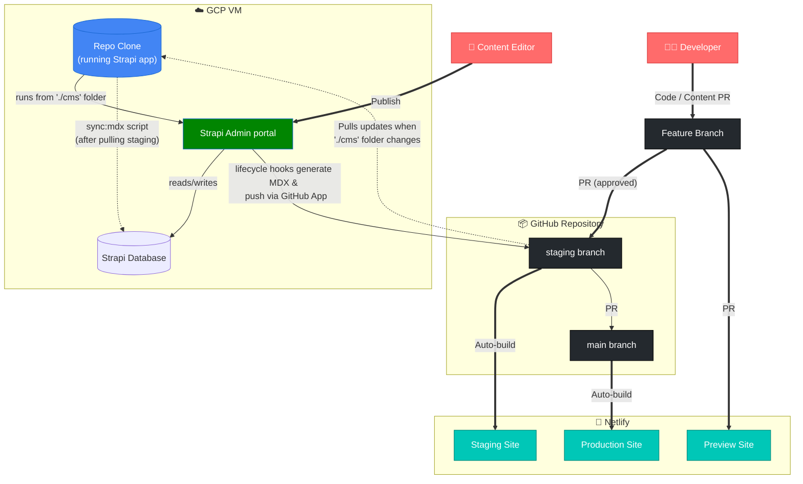

# Interledger.org Website


This repository contains the source code for the [Interledger Foundation website](https://interledger.org), built with [Astro](https://astro.build/), [Starlight](https://starlight.astro.build/) for documentation, and [Strapi](https://strapi.io/) as a headless CMS.

It represents the **fifth major iteration** of interledger.org. For background on previous versions and the site’s evolution, see the [project wiki](https://github.com/interledger/interledger.org-v5/wiki#background).

## Table of Contents

1. [About the Project](#about-the-project)
2. [Architecture Overview](#architecture-overview)
3. [Project Structure](#project-structure)
4. [Local Development](#local-development)
5. [CI / GitHub Workflows](#ci--github-workflows)
6. [Content Workflow](#content-workflow)
   - [Content Synchronization](#content-synchronization)
   - [Preview functionality](#preview-functionality)
   - [Branches and Deployment](#branches-and-deployment)
   - [Environments](#environments)
7. [Contributing](#contributing)
   - [1. Editor Flow](#1-editor-flow-strapi-workflow)
   - [2. Developer Flow - Website content](#2-developer-flow---website-content-astro-content-collections)
   - [3. Developer Flow - Documentation](#3-developer-flow---documentation-starlight)
   - [Writing guidelines for developers](#writing-guidelines-for-developers)
8. [Summit Data (Sessionize Integration)](#summit-data-sessionize-integration)
   - [Overview](#overview)
   - [Syncing Data from Sessionize](#syncing-data-from-sessionize)
   - [How the Data is Used](#how-the-data-is-used)
   - [Adding a New Summit Year](#adding-a-new-summit-year)
   - [Translations](#translations)
   - [Image Handling](#image-handling)
9. [Grantee Data (Airtable Integration)](#grantee-data-airtable-integration)
10. [Developers Roadmap (Linear Integration)](#developers-roadmap-linear-integration)
11. [Image Optimization](#image-optimization)

12. [More Info](#more-info)

## About the Project

- **Astro** provides a modern static site framework for fast, flexible site building.

- **Starlight** adds a ready-made documentation system, including layouts, navigation, and styling, making it easy to write and maintain docs.

- **Strapi** is the headless CMS for content management. Custom lifecycle hooks have been added to automatically synchronize content with the Astro project.

### Styling

- The frontend styling is built using **Tailwind CSS**.
- Design tokens, utility conventions, and custom styles are documented separately: [Styles README](https://github.com/interledger/interledger.org-v5/blob/main/src/styles/README.md)

## Architecture overview


```mermaid
flowchart
    subgraph gcp["☁️ GCP VM"]
        direction TB
        appclone[("Repo Clone<br/>(running Strapi app)")]
        strapidb[("Strapi Database")]
        strapi[Strapi Admin portal]
        appclone -->|"runs from './cms' folder"| strapi
        strapi -->|"reads/writes"| strapidb
    end

    subgraph github["📦 GitHub Repository"]
        direction TB
        staging["staging branch"]
        main["main branch"]
    end

    subgraph netlify["🚀 Netlify"]
        direction TB
        preview["Preview Site"]
        stagingsite["Staging Site"]
        production["Production Site"]
    end

    editor["👤 Content Editor"]
    dev["👨‍💻 Developer"]
    feature["Feature Branch"]

    editor ==>|"Publish"| strapi
    dev ==>|"Code / Content PR"| feature

    strapi -->|"lifecycle hooks generate MDX & <br/> push via GitHub App"| staging

    appclone -.->|"sync:mdx script<br/>(after pulling staging)"| strapidb


    feature ==>|"PR (approved)"| staging
    feature ==>|"PR"| preview

    staging ==>|"Auto-build"| stagingsite
    staging -->|"PR"| main

    staging -.->|"Pulls updates when <br/> './cms' folder changes"| appclone

    main ==>|"Auto-build"| production

    classDef gcpStyle fill:#4285f4,stroke:#1967d2,color:#fff
    classDef portalStyle fill:#018501,stroke:#1967d2,color:#fff
    classDef githubStyle fill:#24292e,stroke:#000,color:#fff
    classDef netlifyStyle fill:#00c7b7,stroke:#008577,color:#fff
    classDef userStyle fill:#ff6b6b,stroke:#d63031,color:#fff
    classDef branchStyle fill:#6c5ce7,stroke:#5f3dc4,color:#fff

    class strapi portalStyle
    class appclone,stagingclone gcpStyle
    class staging,main,feature githubStyle
    class preview,production,stagingsite netlifyStyle
    class editor,dev userStyle
```

## Project structure:

```text
.
├── .github/
│   ├── workflows/
│   └── copilot-instructions.md
├── cms/        # Strapi backend
│   ├── config/              # Strapi configuration files
│   │   ├── admin.ts
│   │   ├── database.ts
│   │   ├── middlewares.ts
│   │   ├── plugins.ts
│   │   └── server.ts
│   ├── database/                      # Database files
│   │   └── migrations/
│   ├── scripts/              # e.g., sync:mdx, sync-navigation
│   ├── src/         # Astro frontend application
│   │   ├── admin/      # Admin UI customizations
│   │   ├── api/
│   │   │   ├──/{content-type}  # e.g., blog-post, foundation-page
│   │   │       ├── content-types/
│   │   │       │       ├── schema.json
│   │   │       │       └── lifecycles.ts  # MDX generation logic
│   │   │       ├── controllers/
│   │   │       ├── routes/
│   │   │       └── services/
│   │   │   └── utils.ts
│   │   ├── components/                # Reusable Strapi components
│   │   │   ├── blocks/                # Content block components
│   │   │   ├── navigation/
│   │   │   └── shared/                # Shared components
│   │   ├── serializers/               # MDX serialization logic
│   │   │   └── blocks/
│   │   ├── utils/
│   │   └── index.ts
│   └── types/                         # TypeScript type definitions
│   │   └── generated/
│   ├── .env                 # Environment variables
│   ├── .gitignore
│   ├── package.json
│   ├── pnpm-lock.yaml
│   ├── pnpm-workspace.yaml
│   ├── strapi-server.js
│   ├── tsconfig.json
│   ├── copy-schemas.js
│   └── README.md
├── public/           # Static assets (images, favicons, uploads)
│   └── uploads/      # User-uploaded media for Strapi local storage
├── src/              # Astro project
│   ├── components/    # Astro components
│   ├── config/        # JSON configs (navigation, etc.)
│   ├── content/       # Markdown/MDX content (blog, summit, docs)
│   │   ├── blog/
│   │   ├── developers/
│   │   ├── docs/
│   │   ├── foundation-pages/
│   │   └── summit/
│   ├── layouts/
│   ├── pages/       # Route pages
│   │   ├── blog/
│   │   ├── developers/
│   │   ├── summit/
│   │   ├── [...page].astro
│   │   └── index.astro
│   ├── schemas/
│   ├── styles/       # Global styles
│   ├── utils/        # Utility functions
│   ├── content.config.ts   # Astro content collections config
│   ├── env.d.ts
│   └── middleware.ts
├── .env                 # Environment variables
├── .env.example
├── .gitignore
├── .nvmrc
├── .prettierignore
├── .prettierrc
├── astro.config.mjs
├── eslint.config.js
├── netlify.toml
├── package.json
├── pnpm-lock.yaml
├── pnpm-workspace.yaml
├── README.md
├── tailwind.config.mjs
└── tsconfig.json
```

## Local Development

### Prerequisites

- [Git](https://git-scm.com/downloads) for version control
- [Node.js](https://nodejs.org/en/download) >= 18.0.0 <= 22.x.x
- [pnpm](https://pnpm.io/installation) >= 9.0.0

### Environment Setup

1. Clone the repository:

```sh
git clone https://github.com/interledger/interledger.org-v5.git
```

2. Install dependencies:

```sh
pnpm install
```

> **Note on lockfiles:** This repo has two `pnpm-lock.yaml` files:
>
> - `/pnpm-lock.yaml` — root workspace lockfile, used locally and in CI
> - `/cms/pnpm-lock.yaml` — standalone lockfile used by the GCP VM when deploying Strapi (`cd cms && pnpm install`)
>
> When `cms/package.json` changes (e.g. upgrading Strapi), regenerate **both**:
>
> ```sh
> pnpm install --no-frozen-lockfile          # from repo root
> cd cms && pnpm install --no-frozen-lockfile # for GCP deployment
> ```

3. Build and start the site:

```sh
# Build for production
pnpm run build

# Start dev server (localhost:1103)
pnpm run start
```

4. For Strapi Admin setup locally, refer to the [/cms/README.md](https://github.com/interledger/interledger.org-v5/blob/main/cms/README.md).

### 🧞 Commands

All commands are run from the root of the project, from a terminal:

| Command                              | Action                                                         |
| :----------------------------------- | :------------------------------------------------------------- |
| `pnpm install`                       | Installs dependencies                                          |
| `pnpm run start`                     | Starts local dev server at `localhost:1103`                    |
| `pnpm run build`                     | Build your production site to `./dist/`                        |
| `pnpm run preview`                   | Preview your build locally, before deploying                   |
| `pnpm run format`                    | Format code and fix linting issues                             |
| `pnpm run lint`                      | Check code formatting and linting                              |
| `pnpm run sync:sessionize -- <YEAR>` | Fetch Sessionize data (JSON + speaker images) for a given year |
| `pnpm run sync:airtable`             | Fetch grantee data from Airtable into a local JSON file        |
| `pnpm run optimize:images`           | Generate responsive WebP variants for all raster images        |

### 🔍 Code Formatting

This project uses [ESLint](https://eslint.org/) for code linting and [Prettier](https://prettier.io/) for code formatting. Before submitting a pull request, please ensure your code is properly formatted:

1. **Fix issues**: Run `pnpm run format` to automatically format code and fix linting issues
2. **Check before pushing**: Run `pnpm run lint` to verify everything passes (CI will also run this)

ESLint is configured to work with TypeScript and Astro files. The configuration extends recommended rules from ESLint, TypeScript ESLint, and Astro ESLint plugins, and integrates with Prettier to avoid conflicts.

## CI / GitHub Workflows

GitHub Actions run automatically on pull requests and branch merges.

Workflows include:

- Linting (ESLint)
- Formatting validation (Prettier)
- Build validation

Pull requests must pass all checks before merging.

## Content Workflow

### Content Synchronization

**Astro is the source of truth** for site content. Strapi lifecycles and synchronization scripts keep the CMS and Astro `.mdx` files in sync.

1. **Strapi → Astro**:
   - Strapi lifecycle hooks trigger `.mdx` file **creation**, **updates**, and **deletions**.
   - Changes are automatically committed and pushed directly to the `staging` branch, where Strapi acts as a contributor.

2. **Astro → Strapi**:
   - Merges in `staging` sync `.mdx` files back into the Strapi database.
   - Scripts like `sync:mdx` handle the synchronization.

### Preview Functionality

- Editors can preview content from Strapi in real time before publishing.
- Page previews become available after saving content as a **draft** or after **publishing**.
- While the rest of the site is statically generated, preview pages use **server-side rendering** in Astro (`export const prerender = false` in `page-preview.astro`).
- Each content type is mapped to a corresponding preview route.

⚠️ Note: Netlify automatically generates Deploy Previews for pull requests opened against `staging` that can be accessed at: `https://deploy-preview-{PR-number}--interledger-org-v5.netlify.app/`. These previews are **frontend-only** and reflect the Astro build at that PR state.

For more information on Strapi lifecycles, synchronization scripts and preview functionality, see [/cms/README.md](https://github.com/interledger/interledger.org-v5/blob/main/cms/README.md).

### Branches and Deployment

- **`main`**:
  - Serves the live production website.
  - Merges to `main` trigger a Netlify rebuild of the production site.

- **`staging`**:
  - Serves the live staging website (deployed via Netlify).
  - Serves the Strapi Admin interface (running on the GCP VM).
  - Any push to `staging` that modifies files in `/cms` triggers a rebuild of the Strapi Admin panel on the GCP VM.
  - Any push to `staging` that modifies `.md` or `.mdx` files in any content collection (`src/content/foundation-pages`, `src/content/summit-pages`, `src/content/foundation-blog-posts`, etc.) also triggers `sync:mdx`, including their localized mirrors under `src/content/<locale>/...`.

### Hosting Architecture

- The Astro website (production and staging) is deployed and hosted via Netlify.
- Strapi (including the Admin panel) runs on a single Google Cloud VM.
- The Strapi instance on the VM tracks the `staging` branch and pulls updates when `/cms` changes are merged.

### Environments

- **Live website** (built from `main`): https://interledger-org-v5.netlify.app/
- **Staging website** (built from `staging`): https://staging--interledger-org-v5.netlify.app/
- **Strapi admin** (controlled via `staging`): https://strapi-admin.interledger.org/

## Contributing

Content can be added in two main ways:

- **Editor workflow (via Strapi Admin)**
- **Developer workflow (via Astro `.mdx` files)**

The developer workflow also includes adding and maintaining documentation.

There are **three contribution paths**, depending on your role and the type of content.

### 1. Editor flow (Strapi workflow)

- Editors create pages and blog posts via **Strapi Admin**.
- Each content type in Strapi has lifecycles configured to **generate/update/delete `.mdx` files in the Astro project** automatically.
  - Example: Creating a foundation page writes MDX under `src/content/foundation-pages/` using **nested folders from the full path slug** (see below): English uses the last segment as the filename; localized pages are written under the collection-level `/{locale}/` directory with the nested slug folders beneath it.
- Content changes are automatically committed and pushed to the `staging` branch by the GitHub App `Interledger Strapi`.

⚠️ Note: Strapi is set up to be a contributor to our code base. When editors use the Strapi interface to make changes, Strapi's lifecycle hooks make commits to the `staging` branch on behalf of the editors.

#### Content Management Documentation

All documentation for working with website content is available in [the wiki](https://github.com/interledger/interledger.org-v5/wiki). Please refer to the wiki for:

- Content creation and editing guidelines
- Adding blog posts and podcast episodes
- Managing multilingual content
- General site-building philosophy

### 2. Developer flow - Website Content (Astro Content Collections)

Developers can add multiple types of content directly to the repository. Each content type has a specific folder and naming convention.

Astro automatically picks up these files, registers them in the appropriate content collection, and generates the correct routes using the associated templates.

#### Content paths vs URL routes

This project has two related but separate pieces of configuration:

- Filesystem content paths: where MDX files live under `src/content/...`
- URL route bases: where those collections are exposed under `src/pages/...`

These should not be treated as interchangeable.

Examples:

- `src/content/foundation-pages` maps to site routes at `/...`
- `src/content/foundation-blog-posts` maps to `/blog/...`
- `src/content/developers-blog-posts` maps to `/developers/blog/...`
- `src/content/summit-pages` maps to `/summit/...`

The main source files for this setup are:

- `src/content.config.ts`
  Defines Astro collection ids such as `'foundation-pages'`, `'foundation-blog'`, `'developers-blog'`, and `'summit-pages'`.
- `src/utils/main/paths.ts`
  Defines filesystem paths and folder names used to load content from disk.
- `src/utils/main/routes.ts`
  Defines `ROUTE_BASES`, the URL base path for each content collection. Use this when building links, language-switcher URLs, or other route-aware behavior.
- `src/utils/main/static-paths.ts`
  Builds localized static paths for collection-backed routes. EN is canonical; ES routes may render EN content when no ES translation exists.
- `src/utils/main/i18.ts`
  Centralizes locale definitions and language-switcher ordering.

Rule of thumb:

- If you are working with folders or files on disk, use `src/utils/main/paths.ts`
- If you are working with browser URLs or route generation, use `src/utils/main/routes.ts`

In Astro `<script>` tags or hydrated browser components, use `@/utils/main/client`.
In `src/content.config.ts`, import collection constants from
`@/utils/main/contentCollections`, not the broad `@/utils` barrel.

When adding a new localized collection or changing route structure, review all of the files above together. They form the core configuration for how content is loaded and how URLs are generated.

**Foundation Blog posts**

- Location: `src/content/foundation-blog-posts`
- Localizations: `src/content/foundation-blog-posts/{locale}`
- Filename format: `YYYY-MM-DD-slug.mdx`

Used for: Foundation news, updates, announcements, thought leadership.

**Tech Blog posts**

- Location: `src/content/developers-blog-posts`
- Localizations: `src/content/developers-blog-posts/{locale}`
- Filename format: `YYYY-MM-DD-slug.mdx`

Used for: Technical deep dives, implementation updates, engineering insights.

**Foundation Pages**

- Location: `src/content/foundation-pages`
- Localizations: `src/content/foundation-pages/{locale}/{parent...}/` (see path slug rules below)
- Filename: last segment of the full path slug + `.mdx` (nested segments become parent directories)

Used for: Static foundation pages such as About, Policy & Advocacy, Team, Grants, etc.

**Summit Pages**

- Location: `src/content/summit-pages`
- Localizations: same nesting pattern as foundation pages
- Filename: last segment of the full path slug + `.mdx`

Used for: Summit landing pages, schedules, speaker lists, event resources.

#### Foundation & Summit routes: **Full Path Slug** (`pathSlug`)

In Strapi this is a **single field** (“Full Path Slug”): the **full URL path of the page**, **without a leading slash**. The same value is stored in MDX frontmatter as `pathSlug`. The **live site URL** is `/{pathSlug}` (normalized, no duplicate slashes).

Examples:

| `pathSlug` (frontmatter / Strapi) | Public URL             |
| --------------------------------- | ---------------------- |
| `about-us`                        | `/about-us`            |
| `grant/grant-for-web`             | `/grant/grant-for-web` |

**On disk (English):** split `pathSlug` on `/`; all segments except the last are folders; the last segment is the filename.

- `about-us` → `foundation-pages/about-us.mdx`
- `grant/grant-for-web` → `foundation-pages/grant/grant-for-web.mdx`

**Localized pages** live under one collection-level locale folder, with nested path segments after it (e.g. `foundation-pages/es/grant/…mdx` for Spanish).

**Example (nested grant page):**

```yaml
---
pathSlug: 'grant/grant-for-web'
---
```

→ public URL: `/grant/grant-for-web`

**Key rules:**

- `pathSlug` is **required** on all foundation and summit pages (the build will fail without it).
- Leading and trailing slashes on `pathSlug` are stripped when parsing content.
- There is **no separate `path`** field in Strapi or frontmatter for these types; use one multi-segment `pathSlug` for nested URLs.
- If `pathSlug` is omitted from frontmatter (not allowed for a valid build), sync tooling may derive a default from the **filename** (without extension and without any `YYYY-MM-DD-` date prefix); nested URLs should use explicit folders + filename that match the intended `pathSlug`, or set `pathSlug` in frontmatter.

**⚠️ Important (Schema Validation)**

- Use correct frontmatter for each content type.
- Follow the required schema — **invalid metadata will break the build**.
- See:
  - `src/schemas/content.ts`
  - `src/content.config.ts` <br/>
    to understand the required schema and validation rules for each content collection.

#### Blog metadata and tags

Each blog post includes frontmatter at the top of the file (title, description, date, authors, etc.), including a `tags` field used for filtering on the blog index.

Please **only use the existing, approved tags** unless you have aligned with the tech + comms team on adding a new one. This helps keep the tag filter focused and avoids fragmentation.

**Current tags:**

- Interledger Protocol
- Open Payments
- Web Monetization
- Rafiki
- Updates
- Releases
- Card Payments

If you believe your post needs a new tag, propose it in your PR description or in the `#tech-team` Slack channel so we can decide whether to add it and update this list.

### 3. Developer flow - Documentation (Starlight)

Documentation pages are managed via Starlight.

Docs live in `src/content/docs`.

Starlight looks for `.md` or `.mdx` files in the `src/content/docs/` directory. Each file is exposed as a route based on its file name.

RFC pages under `src/content/docs/rfcs/` are a small exception. Those route files wrap the upstream markdown from the `interledger/rfcs` repository via `src/components/Rfc.astro`. Internal RFC-to-RFC links are rewritten in `src/utils/docs/rewriteRfcLinks.ts` so the rendered docs point at local Starlight routes instead of upstream `.md` source paths.

Static assets, like favicons or images, can be placed in the `public/` directory. When referencing these assets in your markdown, you do not have to include `public/` in the file path, so an image would have a path like:

```md

```

For more information about the way our documentation projects are set up, please refer to our [documentation style guide](https://interledger.net/#docs-site-building).

#### Developer Contribution Requirements

- Add `.mdx` content in Astro.
- Open PRs against `staging`.
- Use frontmatter correctly — invalid metadata will break the build.
- Run `pnpm run build` and `pnpm run format` before PR.
- The PR must undergo review and pass all checks before it can be merged.

Consult **Writing Guidelines for Developers** below for more details on content structure, metadata, tags, and blog formatting.

### Writing guidelines for developers

**Goal:** Educate, drive adoption, and grow strategic influence.

**Typical Target Audience:**

- Technically-inclined users interested in Interledger development.
- Technically-inclined users interested in financial services technologies, innovations, or developments.
- Users keen on topics like APIs, data analytics, metrics, analysis, and quantitative assessment for digital networks.
- Users interested in privacy and related technologies.

**Possible Content Framework:**

If you're unsure how to structure your writing, you can use this as a guide.

- Introduction / main point
- Context - Interledger’s perspective / stance / commitment on the topic being written [broader categories like privacy, metrics for growth, Digital Financial Inclusion etc.]
- The Challenge (or) The Problem
- The Solution
- The How / implementation
- Roadmap - short-term / long-term
- Note: A call to action (CTA) will be included automatically at the bottom of every post.

Ideal Word Count: Between 1,000 and 2,500 words, with links to relevant documents/pages for a deeper understanding.

#### Getting Started

Discuss Ideas: Before starting, share your blog post ideas with the tech team to ensure alignment and awareness.

Copy the Template: Begin your draft using [this Google Doc template](https://docs.google.com/document/d/1L7vzsYORg9xmf72ljTdmyekpq2vJ7eQZ9atM2uAXgUM/edit?usp=sharing) to maintain a consistent format.

**Review Process**

Initial Reviews:

- Once your draft is ready, request specific reviewers or ask for feedback on the `#tech-team` Slack channel.
- Incorporate feedback and refine the blog post.

Finalizing:

- When the draft is stable, create a pull request in the [interledger.org](https://github.com/interledger/interledger.org-v5) GitHub repo against `staging`.
- Please add links where appropriate so people can easily click to learn more about the concepts you reference.
- Include all images used in the post in the PR.
- No-one is expected to know the ins and outs of Astro (the framework that powers our site), so please tag someone in the frontend team as a reviewer to ensure everything Astro-related is in order.
- The PR will be reviewed by the frontend team before being merged into `staging`.

#### Working with Visuals

- If you need an illustration, submit a design request in advance to Madalina via the `#design` Slack channel using the design request form.
- Before uploading images to GitHub, run them through an image optimizer such as [TinyPNG](https://tinypng.com/).
- Ensure images are appropriately sized; feel free to ask Madalina or Sarah for assistance.

#### Publishing Your Blog Post

- Note: Merging the pull request will **not** publish the blog post immediately. Changes from `staging` are merged into `main` twice a week.
- Ensure the publishing date in the blog post frontmatter matches the intended release date.
- Check with Ioana to confirm the publishing date and keep a consistent posting schedule. Ioana will also handle social media promotion.
- Run `pnpm run build` locally to verify that the page builds correctly.
- Run `pnpm run format` and `pnpm run lint` to format your code and check for any issues before creating a pull request.

## Summit Data (Sessionize Integration)

### Overview

The Interledger Summit has taken place annually since 2022. Each edition has its own pages on the website — sessions(talks), speakers, and their individual detail pages — all scoped by year (e.g. `/summit/2024/speakers`, `/summit/2024/talks`).

All summit data originates from **Sessionize**. A sync script fetches that data and stores it locally in the project as JSON files. Utility functions then read those files to populate Astro components and generate all summit-related pages for every year automatically.

### Syncing Data from Sessionize

Run the following script to fetch summit data for a given year:

```sh
pnpm run sync:sessionize -- <YEAR>
```

Example:

```sh
pnpm run sync:sessionize -- 2022
pnpm run sync:sessionize  # defaults to currentSummitYear
```

**What is does:**

- Defaults to `currentSummitYear` if no year is provided
- Downloads speaker and talk data into:
  - `src/data/sessionize/{YEAR}-speakers.json`
  - `src/data/sessionize/{YEAR}-talks.json`
- Downloads speaker images into:
  - `public/sessionize-speakers/img/{YEAR}`
- Clears the image folder before downloading
- Validates the year against the allowed `YEARS` list

### How the Data Is Used

Once the JSON files are in place, two utility files handle all data access and page generation — no manual wiring is needed.

`extractSessionize.ts`

Responsible for:

- Reading local Sessionize JSON files
- Normalizing data into internal types (Talk, Speaker, etc.)
- Linking talks and speakers
- Handling translations
- Generating local image paths for speakers and adding a fallback image when missing

`summit-talks-speakers.ts`

Responsible for connecting processed data to Astro routing.

It generates:

- Paginated listing pages
  - Talks → `/summit/{year}/talks`
  - Speakers → `/summit/{year}/speakers`
- Dynamic detail pages
  - Talk pages → `/summit/{year}/talks/{talk-title}`
  - Speaker pages → `/summit/{year}/speakers/{speaker-name}`

All of these functions iterate over every year in the `YEARS` list automatically, so new summit data is picked up without any changes to page templates.

### Adding a New Summit Year

1. Add a new entry to `sessionizeApiMap` in `src/utils/main/sessionize.ts`, using the summit year as the key (e.g. `'2026'`) and the corresponding Sessionize API URLs as values:

```typescript
  '2026': {
    speakersUrl: 'https://sessionize.com/api/v2/.../view/Speakers',
    talksUrl: 'https://sessionize.com/api/v2/.../view/Sessions'
  }
```

- `YEARS` and `currentSummitYear` will update automatically — no other changes needed.

2. Run the script `pnpm run sync:sessionize` to fetch data and images for the new summit.

**After syncing, it is recommended to check:**

- That the fields in the new JSON files match those from previous years. In practice, they have always matched, but it is a good habit to verify.
- The hardcoded IDs used for translations (see [Translations](#translations) below), in case Sessionize has changed them.

### Translations

From 2025 onwards, summit content includes Spanish translations. These are stored by Sessionize inside a `questionAnswers` array, present on both speaker and talk objects, using a structure like:

```json
{
  "id": 114105,
  "answer": "Título en español"
}
```

The following IDs are hardcoded in `src/utils/main/extractSessionize.ts`:

| Constant         | ID     | Used for                                   |
| ---------------- | ------ | ------------------------------------------ |
| SPANISH_TITLE_ID | 114105 | Spanish title of a talk                    |
| SPANISH_DESC_ID  | 114099 | Spanish description of a talk              |
| SPANISH_BIO_ID   | 114100 | Spanish bio of a speaker                   |
| TRANSLATION_ID   | 107734 | Available translation languages for a talk |

When importing data for a new summit, verify that these IDs have not changed in the Sessionize export. If they have, update the constants in `extractSessionize.ts` accordingly.

#### Adding Support for a New Language

To add a new language to the Sessionize data pipeline:

1. Add the locale code to `SESSIONIZE_SUPPORTED_LOCALES` in `src/types/summit.ts`:

```typescript
export const SESSIONIZE_SUPPORTED_LOCALES = ['es', 'fr'] as const
```

2. Update the utility functions in `src/utils/main/extractSessionize.ts` to extract the new language's fields from `questionAnswers`, following the same pattern used for Spanish. Each function should add a new key to the returned translations object (e.g. `fr: { title, description }`) alongside the existing `es: {}` entry. You will also need to add the corresponding Sessionize question IDs as constants (same as `SPANISH_TITLE_ID`, `SPANISH_DESC_ID`, etc.).

### Image Handling

- Speaker images are downloaded locally during sync
- Stored under:
  `public/sessionize-speakers/img/{YEAR}/`
- Filenames are generated using a slugified speaker name
- If no image is available, a fallback is used:
  `public/sessionize-speakers/img/no-photo.svg`

## Grantee Data (Airtable Integration)

To make the work funded through Interledger Foundation grants easier to explore, the website will host a publicly accessible grantee database sourced from Airtable. A sync script fetches approved records into a local JSON file; rendering the data on the site will follow in a later phase.

### Syncing Data from Airtable

```sh
pnpm run sync:airtable
```

**What it does:**

- Fetches records from the **Projects** table using a configured view
- Resolves linked **Project Leader** IDs into contact names from the **Contacts** table
- Writes the result to `src/data/airtable/grantee-data.json`

**Requirements:**

- `AIRTABLE_API_TOKEN` must be set in your environment (see `.env.example`)

The Airtable base ID, table IDs, view ID, and relevant field IDs are pinned as constants at the top of `scripts/import-airtable.ts`. They reference Airtable IDs (stable across renames), not field names — so editors can rename fields in Airtable without breaking the script.

## Developers Roadmap (Linear Integration)

The `/developers/roadmap` page shows a public timeline of tech projects sourced from a Linear custom view. It is server-side rendered (`export const prerender = false`): the page reads a pre-built snapshot from Netlify Blobs at request time and never calls the Linear API itself.

```text
Linear API ──(sync function)──▶ Netlify Blob ──(SSR read at request time)──▶ /developers/roadmap ──▶ Netlify CDN cache
```

Two Netlify Functions build the snapshot from Linear and write it to the blob (store `roadmap`, key `roadmap-snapshot`):

- `netlify/functions/roadmap-sync.mts` runs on a 12-hour cron (`0 */12 * * *`, UTC) on Netlify's scheduled-functions infrastructure.
- `netlify/functions/roadmap-sync-now.mts` is a manual trigger at `POST /api/roadmap-sync`, protected by a bearer `API_SECRET` and rate-limited to once per 5 minutes.

Both fetch Linear, overwrite the blob, and purge the CDN cache. The page renders whatever is in the blob.

### When does the roadmap refresh?

- **Automatically every 12 hours**, via the scheduled function. This runs on Netlify's cron independently of site builds and traffic.
- **On demand**, when someone calls the manual endpoint.
- **Not on build.** Builds do not re-fetch Linear or seed the blob; the blob persists across deploys.
- **Not instantly on a Linear edit.** There is no Linear webhook, so a change in Linear appears at the next scheduled sync (within 12h) or whenever the manual endpoint is called. A Linear webhook pointed at the manual endpoint would make this near-instant and is a possible future addition.

### Triggering a manual sync

There is no UI button. Anyone with the `API_SECRET` can force an immediate refresh:

```sh
curl -X POST https://<site>/api/roadmap-sync \
  -H "Authorization: Bearer $API_SECRET"
```

### CDN caching (important)

The page sets `Netlify-CDN-Cache-Control: public, max-age=43200, stale-while-revalidate=86400`, so Netlify's CDN caches the rendered HTML for 12 hours. This keeps the page fast, but it means a freshly-synced blob is not visible until that cached HTML is invalidated.

The sync functions invalidate it by calling Netlify's cache-purge API after each write, but **only if `NETLIFY_API_TOKEN` is set**. Without that token:

- The blob still updates on schedule.
- The CDN keeps serving the previously-rendered HTML until its 12h `max-age` expires, then `stale-while-revalidate` re-renders in the background.
- So a manual sync will not make fresh data appear promptly. If you want an immediate refresh after a sync, `NETLIFY_API_TOKEN` is effectively required.

### Environment variables

| Variable                | Required   | Notes                                                                                 |
| ----------------------- | ---------- | ------------------------------------------------------------------------------------- |
| `LINEAR_API_KEY`        | Production | Read-only Linear API key used by the sync functions.                                  |
| `API_SECRET`            | Production | Bearer token gating `POST /api/roadmap-sync`.                                         |
| `LINEAR_CUSTOM_VIEW_ID` | No         | Defaults to the public roadmap view, baked into `src/linear/env.ts`. Set to override. |
| `NETLIFY_API_TOKEN`     | No         | Enables the CDN cache purge after a sync (see above).                                 |
| `NETLIFY_SITE_ID`       | Auto       | Injected by Netlify at runtime.                                                       |

Only the sync functions read these; the page does not. A missing `LINEAR_API_KEY` fails the sync (logged in Netlify's function logs) without breaking the page.

### Local development

The roadmap page works locally with no secrets:

- `pnpm start` renders the board with a bundled fixture (`src/data/roadmap/fixture.ts`), since `astro dev` has no Blobs runtime.
- To exercise the real data path, run `netlify dev`, set `LINEAR_API_KEY` in `.env`, then POST to `/api/roadmap-sync` with the bearer `API_SECRET`.

In production, an empty or unreadable blob renders a graceful empty state rather than placeholder data.

## Image Optimization

Raster images (`.jpg`, `.jpeg`, `.png`, `.webp`, `.gif`) are automatically optimized at build time via `scripts/optimize-images.ts`. The script uses [`sharp`](https://sharp.pixelplumbing.com/) to produce WebP variants at three responsive widths (640px, 1280px, 1920px) plus a full-size WebP, writing outputs to `public/img/optimized/`.

The script runs automatically as part of `pnpm run build` (via the `prebuild` hook). You can also run it manually:

```sh
pnpm run optimize:images
```

**How it works:**

- Images are sourced from two locations:
  - `public/img/` — static assets committed to the repo
  - `public/uploads/img/original/` — images uploaded via Strapi
- Each image produces variants at widths ≤ its original width, avoiding upscaling
- Outputs are cached: a variant is skipped if it already exists and is newer than the source
- The `public/img/optimized/` directory is gitignored — variants are generated at build time

**Component usage:**

The `OptimizedImage` Astro component (`src/components/shared/OptimizedImage.astro`) wraps the optimized variants in a `<picture>` element with a WebP `<source srcset="...">` and a responsive `sizes` attribute, falling back to the original `` if no variants exist. It is wired into all MDX contexts as the default `img` renderer, so inline images in content get responsive output automatically.

To use it directly in Astro templates:

```astro
import OptimizedImage from '@/components/shared/OptimizedImage.astro'

<OptimizedImage
  src="/img/hero.png"
  alt="Hero image"
  sizes="(max-width: 640px) 100vw, 50vw"
/>
```

SVGs are passed through unchanged.

## More Info

Details on **Strapi lifecycles**, **MDX syncing**, and **preview functionality**, and how to **set up a local Strapi instance** are documented in [/cms/README.md](https://github.com/interledger/interledger.org-v5/blob/main/cms/README.md).
