# Interledger.org

The official [Interledger.org](https://interledger.org/) website built with [Astro](https://astro.build/) and [Starlight](https://starlight.astro.build/).

## Quick Start

```bash
bun install # Install dependencies
bun run start # Start dev server 
```

## Architecture Overview

```mermaid
flowchart
    subgraph gcp["☁️ GCP VM"]
        direction TB
        strapi[(Strapi CMS)]
        gitclone[("Git Clone<br/>(staging)")]
        strapi -->|"writes MDX"| gitclone
    end
    
    subgraph github["📦 GitHub Repository"]
        direction TB
        staging["staging branch"]
        main["main branch"]
    end
    
    subgraph netlify["🚀 Netlify"]
        direction TB
        preview["Preview Site"]
        production["Production Site"]
    end
    
    editor["👤 Content Editor"]
    dev["👨‍💻 Developer"]
    feature["Feature Branch"]
    
    editor ==>|"Publish"| strapi
    dev ==>|"Code PR"| feature
    
    gitclone ==>|"Push via<br/>lifecycle hooks"| staging
    feature ==>|"PR"| staging
    
    staging ==>|"Auto-build"| preview
    staging -->|"PR (approved)"| main
    
    main ==>|"Auto-build"| production
    
    gitclone -.-|"Sync after<br/>PR merge"| strapi
    
    classDef gcpStyle fill:#4285f4,stroke:#1967d2,color:#fff
    classDef githubStyle fill:#24292e,stroke:#000,color:#fff
    classDef netlifyStyle fill:#00c7b7,stroke:#008577,color:#fff
    classDef userStyle fill:#ff6b6b,stroke:#d63031,color:#fff
    classDef branchStyle fill:#6c5ce7,stroke:#5f3dc4,color:#fff
    
    class strapi,gitclone gcpStyle
    class staging,main,feature githubStyle
    class preview,production netlifyStyle
    class editor,dev userStyle
```


**Workflow:**
1. **Content editors** publish in Strapi → MDX generated → committed to `staging`
2. **Developers** create feature branches → PR to `staging`
3. **Staging** auto-deploys to Netlify preview for review
4. **Approved changes** merged to `main` via PR
5. **Production** auto-deploys from `main`

**Recovery:** The `sync-mdx.cjs` script can restore Strapi database from MDX files in git.

## Project Structure

```text
├── cms/              # Strapi CMS for content management
├── public/           # Static assets (images, favicons)
├── scripts/          # Sync and import scripts
├── src/
│   ├── components/   # Astro/React components
│   ├── config/       # Site configuration
│   ├── content/      # MDX content (blog, press, docs)
│   ├── layouts/      # Page layouts
│   ├── pages/        # Route pages
│   ├── styles/       # Global styles
│   └── utils/        # Utility functions
└── astro.config.mjs  # Astro configuration
```

## Commands

| Command           | Action                               |
| :---------------- | :----------------------------------- |
| `bun run start`   | Start dev server at `localhost:1103` |
| `bun run build`   | Build production site to `./dist/`   |
| `bun run format`  | Format code with Prettier/ESLint     |
| `bun run lint`    | Check code formatting and linting    |

## CMS

```bash
cd cms
bun install
bun run develop
```

Admin panel: <http://localhost:1337/admin>

When content is published in Strapi, lifecycle hooks generate MDX and (for pages and blog posts) commit and push those files to GitHub to trigger preview builds. Grant tracks only write MDX locally and do not commit. Set `STRAPI_DISABLE_GIT_SYNC=true` to disable the git commit/push behavior.

Default MDX output locations:
- Pages: `src/content/foundation-pages/` (localized pages: `src/content/{locale}/foundation-pages/`)
- Blog posts: `src/content/blog/`

## MDX to Strapi Sync Script

The `sync-mdx` script synchronizes MDX files from the filesystem into Strapi CMS. This is useful for:
- Restoring Strapi content from MDX files in git
- Importing new MDX files created outside Strapi
- Syncing locale translations that reference English entries via `localizes` field

### Usage

```bash
cd cms

# Preview changes without applying them
bun run sync:mdx:dry-run

# Apply changes (only works on main branch)
bun run sync:mdx
```

### How It Works

The sync script performs a bidirectional sync:

1. **Scans MDX files** from:
   - `src/content/blog/` → `blog-posts` content type
   - `src/content/foundation-pages/` → `foundation-pages` content type
   - `src/content/summit/` → `summit-pages` content type
   - Locale directories: `src/content/{locale}/*/` for translations

2. **Validates frontmatter** using Zod schemas (skips invalid files)

3. **Syncs English entries**:
   - Creates new entries if MDX doesn't exist in Strapi
   - Updates existing entries if MDX has changed
   - Matches locale files via `localizes` field in frontmatter

4. **Syncs locale translations**:
   - Matches locale files to English entries using `localizes: "english-slug"` field
   - Creates/updates localizations in Strapi
   - Handles unmatched locales by searching Strapi for matching English entries

5. **Cleans up orphaned entries**:
   - Deletes Strapi entries that no longer have corresponding MDX files

### Locale Matching

Locale files are matched to English entries using the `localizes` field:

```yaml
---
slug: "sobre-nosotros"
title: "About Us"
locale: "es"
localizes: "about-us"  # Links to English entry with slug "about-us"
---
```

The script will:
- Find the English entry with `slug: "about-us"`
- Create/update a Spanish localization linked to that entry
- Preserve the `localizes` field in the generated MDX

### Requirements

- Strapi must be running and accessible
- Environment variables in `.env`:
  - `STRAPI_URL` (e.g., `http://localhost:1337`)
  - `STRAPI_API_TOKEN` (from Strapi admin → Settings → API Tokens)
- For non-dry-run: must be on `main` branch (use `--dry-run` to preview on other branches)

### Tests

Tests are located in `cms/scripts/sync-mdx/__tests/`:

```bash
cd cms
bun test
```

Test coverage includes:
- Locale matching via `localizes` field
- File scanning and validation
- Entry creation and updates
- Locale attachment to English entries
