# Interledger.org

The official [Interledger.org](https://interledger.org/) website built with [Astro](https://astro.build/) and [Starlight](https://starlight.astro.build/).

## Quick Start

```bash
# Install dependencies
bun install

# Start dev server (localhost:1103)
bun run start

# Build for production
bun run build
```

## Architecture Overview

```mermaid
flowchart
    subgraph gcp["☁️ GCP VM"]
        direction TB
        appclone[("Repo Clone A<br/>(running Strapi app)")]
        stagingclone[("Repo Clone B<br/>(staging sync target)")]
        strapi[Strapi Admin portal]
        appclone -->|"hosts './cms' folder"| strapi
        strapi -->|"writes MDX"| stagingclone
    end

    subgraph github["📦 GitHub Repository"]
        direction TB
        staging["staging branch"]
        main["main branch"]
    end

    subgraph netlify["🚀 Netlify"]
        direction TB
        preview["Preview Site"]
        production["Production Site"]
    end

    github -.->|"Manual strapi workflow"| strapi

    editor["👤 Content Editor"]
    dev["👨‍💻 Developer"]
    feature["Feature Branch"]

    editor ==>|"Publish"| strapi
    dev ==>|"Code PR"| feature

    stagingclone ==>|"Push via<br/>lifecycle hooks"| staging
    feature ==>|"PR"| staging

    staging ==>|"Auto-build"| preview
    staging -->|"PR (approved)"| main

    main ==>|"Auto-build"| production

    staging -.->|"Pull updates"| appclone

    classDef gcpStyle fill:#4285f4,stroke:#1967d2,color:#fff
    classDef portalStyle fill:#018501,stroke:#1967d2,color:#fff
    classDef githubStyle fill:#24292e,stroke:#000,color:#fff
    classDef netlifyStyle fill:#00c7b7,stroke:#008577,color:#fff
    classDef userStyle fill:#ff6b6b,stroke:#d63031,color:#fff
    classDef branchStyle fill:#6c5ce7,stroke:#5f3dc4,color:#fff

    class strapi portalStyle
    class appclone,stagingclone gcpStyle
    class staging,main,feature githubStyle
    class preview,production netlifyStyle
    class editor,dev userStyle
```



**Workflow:**

1. **Content editors** publish in Strapi (running from VM Clone A) → MDX generated in VM Clone B → committed to `staging`
2. **Developers** create feature branches → PR to `staging`
3. **Staging** auto-deploys to Netlify preview for review
4. **Approved changes** merged to `main` via PR
5. **Production** auto-deploys from `main`

## Project Structure

```text
├── cms/              # Strapi CMS for content management
├── public/           # Static assets (images, favicons)
├── scripts/          # Sync and import scripts
├── src/
│   ├── components/   # Astro/React components
│   ├── config/       # Site configuration
│   ├── content/      # MDX content (blog, press, docs)
│   ├── layouts/      # Page layouts
│   ├── pages/        # Route pages
│   ├── styles/       # Global styles
│   └── utils/        # Utility functions
└── astro.config.mjs  # Astro configuration
```

## Commands

| Command           | Action                               |
| :---------------- | :----------------------------------- |
| `bun run start`   | Start dev server at `localhost:1103` |
| `bun run build`   | Build production site to `./dist/`   |
| `bun run preview` | Preview production build locally     |
| `bun run format`  | Format code with Prettier/ESLint     |
| `bun run lint`    | Check code formatting and linting    |

## CMS

```bash
cd cms
npm install
npm run develop
```

Admin panel: <http://localhost:1337/admin>

When content is published in Strapi, lifecycle hooks generate MDX and (for pages and blog posts) commit and push those files to GitHub to trigger preview builds. Grant tracks only write MDX locally and do not commit. Set `STRAPI_DISABLE_GIT_SYNC=true` to disable the git commit/push behavior.

Git sync now targets a dedicated local clone for staging publishing instead of resolving the repo via a relative path. Configure this with:

- `STRAPI_GIT_SYNC_REPO_PATH`: Absolute path (or `~/...`) to the git working copy used by lifecycle hooks. Default: `~/interledger.org-v5-staging`.

Page MDX output defaults to `src/content/foundation-pages` inside that repo clone. You can override with `MDX_OUTPUT_PATH` (preferred) or `PAGES_MDX_OUTPUT_PATH` (legacy fallback).

Why this was added:

- Avoids ambiguity from relative-path resolution when Strapi starts from different working directories.
- Keeps CMS content commits isolated to a dedicated staging checkout.
- Enables startup validation that the target folder exists and is on the `staging` branch before any sync runs.

Default MDX output locations:

- Pages: `src/content/foundation-pages/` (localized pages: `src/content/{locale}/foundation-pages/`)
- Blog posts: `src/content/blog/`
- Grant tracks: `src/content/grants/`
