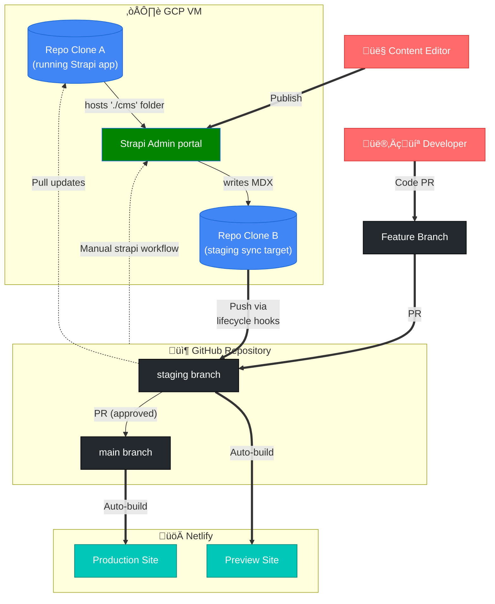

# Interledger.org Website


This repository contains the source code for the [Interledger Foundation website](https://interledger.org), built with [Astro](https://astro.build/), [Starlight](https://starlight.astro.build/) for documentation, and [Strapi](https://strapi.io/) as a headless CMS.

It represents the **fifth major iteration** of interledger.org. For background on previous versions and the site’s evolution, see the [v4 project wiki](https://github.com/interledger/interledger.org-v4/wiki#background).

## Table of Contents

1. [About the Project](#about-the-project)
2. [Architecture Overview](#architecture-overview)
3. [Project Structure](#project-structure)
4. [Local Development](#local-development)
5. [CI / Github Workflows](#ci--github-workflows)
6. [Content Workflow](#content-workflow)
   - [Astro as the Source of Truth](#astro-as-the-source-of-truth)
   - [Preview functionality](#preview-functionality)
   - [Branches and Deployment](#branches-and-deployment)
   - [Environments](#environments)
7. [Contributing](#contributing)
   - [Developer Flow](#developer-flow)
   - [Editor Flow](#editor-flow)
   - [Writing guidelines for developers](#writing-guidelines-for-developers)
8. [More Info](#more-info)

## About the Project

- **Astro** provides a modern static site framework for fast, flexible site building.

- **Starlight** adds a ready-made documentation system, including layouts, navigation, and styling, making it easy to write and maintain docs.

- **Strapi** is the headless CMS for content management. Custom lifecycles have been added to automatically synchronize content with the Astro project.

### Styling

- The frontend styling is built using **Tailwind CSS**.
- Design tokens, utility conventions, and custom styles are documented separately: [Styles README](https://github.com/interledger/interledger.org-v5/blob/f8d490be47b8e39d4ccd141dcd6a2aa4c4a2cde6/src/styles/README.md)

<!-- TODO - update Architecture overview -->

## Architecture overview



## Project structure:

```text
.
├─ /cms              # Strapi project for content management
│   ├─ /scripts      # Scripts, e.g., sync:mdx
│   └─ /src
│       ├─ /admin
│       └─ /api
│           └─ {content-types}  # Each content type has lifecycle, schema, etc.
├── /public           # Static assets (images, favicons)
├─ /src              # Astro project
│   ├─ /components    # Astro components
│   ├─ /config        # JSON configs (navigation, etc.)
│   ├─ /content       # Markdown/MDX content (blog, summit, docs)
│   │   ├─ /blog
│   │   ├─ /developers
│   │   ├─ /docs
│   │   ├─ /foundation-pages
│   │   └─ /summit
│   ├── /content.config
│   ├─ /layouts
│   └─ /pages         # Route pages
│   ├── /styles       # Global styles
│   └── /utils
├── astro.config.mjs
├── package.json
└── tsconfig.json
```

Starlight looks for `.md` or `.mdx` files in the `src/content/docs/` directory. Each file is exposed as a route based on its file name.

Static assets, like favicons or images, can be placed in the `public/` directory. When referencing these assets in your markdown, you do not have to include `public/` in the file path, so an image would have a path like:

```md

```

For more information about the way our documentation projects are set up, please refer to our [documentation style guide](https://interledger.net/#docs-site-building).

## Local Development

### Prerequisites

- [Git](https://git-scm.com/downloads) for version control
- Node.js >= 18.0.0 <= 22.x.x
- pnpm >= 9.0.0

### Environment Setup

1. Clone the repository:

```sh
git clone https://github.com/interledger/interledger.org-v5.git
```

2. Install dependencies:

```sh
pnpm install
```

3. Build and start the site:

```sh
# Build for production
pnpm run build

# Start dev server (localhost:1103)
pnpm run start
```

4. For Strapi Admin setup locally, refer to the [/cms/README.md](https://github.com/interledger/interledger.org-v5/blob/main/cms/README.md).

### 🧞 Commands

All commands are run from the root of the project, from a terminal:

| Command            | Action                                       |
| :----------------- | :------------------------------------------- |
| `pnpm install`     | Installs dependencies                        |
| `pnpm run start`   | Starts local dev server at `localhost:1103`  |
| `pnpm run build`   | Build your production site to `./dist/`      |
| `pnpm run preview` | Preview your build locally, before deploying |
| `pnpm run format`  | Format code and fix linting issues           |
| `pnpm run lint`    | Check code formatting and linting            |

### 🔍 Code Formatting

This project uses [ESLint](https://eslint.org/) for code linting and [Prettier](https://prettier.io/) for code formatting. Before submitting a pull request, please ensure your code is properly formatted:

1. **Fix issues**: Run `pnpm run format` to automatically format code and fix linting issues
2. **Check before pushing**: Run `pnpm run lint` to verify everything passes (CI will also run this)

ESLint is configured to work with TypeScript and Astro files. The configuration extends recommended rules from ESLint, TypeScript ESLint, and Astro ESLint plugins, and integrates with Prettier to avoid conflicts.

## CI / GitHub Workflows

GitHub Actions run automatically on pull requests and branch merges.

Workflows include:

- Linting (ESLint)
- Formatting validation (Prettier)
- Build validation

Pull requests must pass all checks before merging.

## Content Workflow

### Astro as the Source of Truth

The repository designates **Astro as the source of truth**, with bidirectional synchronization between Strapi and the codebase.

1. **Strapi → Astro**:
   - Strapi lifecycle hooks trigger `.mdx` file creation, updates, and deletions.
   - Changes are automatically committed and pushed directly to the `staging` branch, where Strapi acts as a contributor.

2. **Astro → Strapi**:
   - Merges in `staging` sync `.mdx` files back into the Strapi database.
   - Scripts like `sync:mdx` handle the synchronization.

### Preview Functionality

- Editors can preview content from Strapi in real time before publishing.
- Page previews become available after saving content as a **draft** or after **publishing**.
- While the rest of the site is statically generated, preview pages use **server-side rendering** in Astro (`export const prerender = false` in `page-preview.astro`).
- Each content type is mapped to a corresponding preview route.

### Branches and Deployment

- **`staging`**:
  - Serves the live Strapi Admin interface.
  - Any merge to `staging` that modifies files in the `/cms` folder triggers a rebuild of Strapi Admin.
  - Every merge to `staging` also runs the `sync:mdx` script to synchronize content between Strapi and Astro.

- **`main`**:
  - Serves the live website.
  - Merges to `main` trigger a Netlify rebuild of the production site.

**Strapi Admin** runs on GCP virtual machines, and the deployments of both the **Strapi Admin** and the **website** are managed via Netlify.

For more information on Strapi lifecycles, synchronization scripts and preview functionality, see [/cms/README.md](https://github.com/interledger/interledger.org-v5/blob/main/cms/README.md).

### Environments

<!-- PROD:
- **Production**: https://interledger.org
- **Staging**: https://staging.interledger.org -->

<!-- CURRENT:  -->

- **Live website**: https://interledger-org-v5.netlify.app/
- **Strapi admin**: TODO (insert link when available)
- **Staging**: TODO (insert link when available)

## Contributing

Add pages or blog posts either via Strapi (editor workflow) or as `.mdx` files (developer workflow).

### Developer flow:

- Add `.mdx` content in Astro.
- Open PRs against `staging`.
- Use frontmatter correctly — invalid metadata will break the build.
- Run `pnpm run build` and `pnpm run format` before PR.
- Consult [Writing Guidelines for Developers](#writing-guidelines-for-developers) below for more details on content structure, metadata, tags, and blog formatting.

### Editor flow

- Editors create pages and blog posts via **Strapi Admin**.
- Each content type in Strapi has lifecycles configured to **generate/update/delete `.mdx` files in the Astro project** automatically.
  - Example: Creating a blog post in Strapi generates `src/content/blog/{blog-title}.mdx`.
- Content changes are automatically commited and pushed to the `staging` branch.

#### Content Management Documentation

All documentation for working with website content is available in [the wiki](https://github.com/interledger/interledger.org-v5/wiki). Please refer to the wiki for:

- Content creation and editing guidelines
- Adding blog posts and podcast episodes
- Managing multilingual content
- General site-building philosophy

### Writing guidelines for developers

**Goal:** Educate, drive adoption, and grow strategic influence.

**Typical Target Audience:**

- Technically-inclined users interested in Interledger development.
- Technically-inclined users interested in financial services technologies, innovations, or developments.
- Users keen on topics like APIs, data analytics, metrics, analysis, and quantitative assessment for digital networks.
- Users interested in privacy and related technologies.

**Possible Content Framework:**

If you're unsure how to structure your writing, you can use this as a guide.

- Introduction / main point
- Context - Interledger’s perspective / stance / commitment on the topic being written [broader categories like privacy, metrics for growth, Digital Financial Inclusion etc.]
- The Challenge (or) The Problem
- The Solution
- The How / implementation
- Roadmap - short-term / long-term
- Note: A call to action (CTA) will be included automatically at the bottom of every post.

Ideal Word Count: Between 1,000 and 2,500 words, with links to relevant documents/pages for a deeper understanding.

#### Blog metadata and tags

Each blog post includes frontmatter at the top of the file (title, description, date, authors, etc.), including a `tags` field used for filtering on the blog index.

⚠️ The frontmatter must follow the required schema and formatting conventions. Invalid or missing fields will cause the build to fail.

Please **only use the existing, approved tags** unless you have aligned with the tech + comms team on adding a new one. This helps keep the tag filter focused and avoids fragmentation.

**Current tags:**

- Interledger Protocol
- Open Payments
- Web Monetization
- Rafiki
- Updates
- Releases
- Card Payments

If you believe your post needs a new tag, propose it in your PR description or in the `#tech-team` Slack channel so we can decide whether to add it and update this list.

#### Getting Started

Discuss Ideas: Before starting, share your blog post ideas with the tech team to ensure alignment and awareness.

Copy the Template: Begin your draft using [this Google Doc template](https://docs.google.com/document/d/1L7vzsYORg9xmf72ljTdmyekpq2vJ7eQZ9atM2uAXgUM/edit?usp=sharing) to maintain a consistent format.

**Review Process**

Initial Reviews:

- Once your draft is ready, request specific reviewers or ask for feedback on the #tech-team Slack channel.
- Incorporate feedback and refine the blog post.

Finalizing:

- When the draft is stable, create a pull request in the [interledger.org](https://github.com/interledger/interledger.org-v5) GitHub repo against `staging`.
- Please add links where appropriate so people can easily click to learn more about the concepts you reference.
- Include all images used in the post in the PR.
- Content merged into `staging` will be reviewed by the frontend team before being promoted to `main`.

#### Working with Visuals

- If you need an illustration, submit a design request in advance to Madalina via the #design Slack channel using the design request form.
- Before uploading images to GitHub, run them through an image optimizer such as [TinyPNG](https://tinypng.com/).
- Ensure images are appropriately sized; feel free to ask Madalina or Sarah for assistance.

#### Publishing Your Blog Post

- Note: Merging the pull request will **not** publish the blog post immediately. Changes from `staging` are merged into `main` twice a week.
- Ensure the publishing date in the blog post frontmatter matches the intended release date.
- Check with Ioana to confirm the publishing date and keep a consistent posting schedule. Ioana will also handle social media promotion.
- Run `pnpm run build` locally to verify that the page builds correctly.
- Run `pnpm run format` and `pnpm run lint` to format your code and check for any issues before creating a pull request.

## More Info

Details on **Strapi lifecycles**, **MDX syncing**, and **preview functionality** are documented in [/cms/README.md](https://github.com/interledger/interledger.org-v5/blob/main/cms/README.md).
