# Content Publishing Workflow

## Overview

This document defines the content publishing workflow for interledger.org, using Strapi CMS, Git branches, and Netlify deployments.


## Architecture Overview

```mermaid
flowchart
    subgraph gcp["☁️ GCP VM"]
        direction TB
        strapi[(Strapi CMS)]
        gitclone[("Git Clone<br/>(staging)")]
        strapi -->|"writes MDX"| gitclone
    end
    
    subgraph github["📦 GitHub Repository"]
        direction TB
        staging["staging branch"]
        main["main branch"]
    end
    
    subgraph netlify["🚀 Netlify"]
        direction TB
        preview["Preview Site"]
        production["Production Site"]
    end
    
    editor["👤 Content Editor"]
    dev["👨‍💻 Developer"]
    feature["Feature Branch"]
    
    editor ==>|"Publish"| strapi
    dev ==>|"Code PR"| feature
    
    gitclone ==>|"Push via<br/>lifecycle hooks"| staging
    feature ==>|"PR"| staging
    
    staging ==>|"Auto-build"| preview
    staging -->|"PR (approved)"| main
    
    main ==>|"Auto-build"| production
    
    gitclone -.-|"Restore via<br/>sync-mdx.cjs"| strapi
    
    classDef gcpStyle fill:#4285f4,stroke:#1967d2,color:#fff
    classDef githubStyle fill:#24292e,stroke:#000,color:#fff
    classDef netlifyStyle fill:#00c7b7,stroke:#008577,color:#fff
    classDef userStyle fill:#ff6b6b,stroke:#d63031,color:#fff
    classDef branchStyle fill:#6c5ce7,stroke:#5f3dc4,color:#fff
    
    class strapi,gitclone gcpStyle
    class staging,main,feature githubStyle
    class preview,production netlifyStyle
    class editor,dev userStyle
```




## Workflow Summary

1. **Content editors** publish changes in Strapi
2. Strapi lifecycle hooks generate MDX and commit to `staging` branch
3. Netlify automatically builds and deploys staging preview
4. **Product owner** reviews staging content
5. Approved changes are promoted to `main` via pull request
6. Netlify automatically deploys `main` to production

## Branch Strategy

- `staging` - Preview environment for content review
- `main` - Production environment (always reflects live site)

All content changes flow through `staging` → `main` via pull request.

---

## User Stories

### Story 1: Content Editor Publishes Changes
**As a** content editor  
**I want** to publish content changes in Strapi  
**So that** they are automatically committed to the staging branch and available for review

**Acceptance Criteria:**
- When I publish content in Strapi, lifecycle hooks generate MDX files
- The generated MDX is committed and pushed to the `staging` branch
- The commit message clearly indicates what content was added/updated/deleted

---

### Story 2: Automatic Staging Preview Build
**As a** content editor or reviewer  
**I want** Netlify to automatically build and deploy the staging branch  
**So that** I can preview my changes before they go to production

**Acceptance Criteria:**
- Netlify detects commits to `staging` branch
- A new preview build is triggered automatically
- The staging preview URL is accessible for review
- Build failures are reported clearly

---

### Story 3: Product Owner Reviews Staging Content
**As a** product owner  
**I want** to review content on the staging preview site  
**So that** I can approve or reject changes before production

**Acceptance Criteria:**
- Staging preview URL displays the latest content from `staging` branch
- I can view all pages, blog posts, and content changes
- The preview accurately represents what will appear in production
- I can provide feedback to content editors if changes are needed

---

### Story 4: Promote Staging to Production via PR
**As a** product owner  
**I want** to promote approved staging content to production via a pull request  
**So that** changes are traceable and reviewed before going live

**Acceptance Criteria:**
- I create a PR from `staging` to `main`
- PR shows all content changes (MDX files) clearly
- PR can be reviewed and approved by authorized team members
- Merging the PR triggers production deployment
- `main` branch always reflects production content

---

### Story 5: Production Deployment
**As a** the system  
**I want** to automatically deploy `main` branch to production  
**So that** approved content goes live

**Acceptance Criteria:**
- Netlify detects commits/merges to `main` branch
- Production build is triggered automatically
- Production site is updated with new content
- Build artifacts are stored for potential rollback
- Deployment status is visible to the team

---

### Story 6: Rollback Production Deployment
**As a** product owner or site administrator  
**I want** to rollback to a previous production deployment  
**So that** I can quickly recover from issues

**Acceptance Criteria:**
- I can view all previous production deploys in Netlify UI
- I can instantly rollback to any previous deploy without rebuilding
- Rollback is immediate (switches to stored build artifacts)
- If rollback needs to be permanent, I can revert the git commits in `main`
- Team is notified when a rollback occurs

---

### Story 7: Preview Unpublished Content
**As a** content editor  
**I want** to preview draft content before publishing  
**So that** I can verify it looks correct without triggering builds

**Acceptance Criteria:**
- I can use the preview page URL with a document ID parameter
- Preview page fetches draft content directly from Strapi (SSR)
- Preview does not require publishing or triggering builds
- Preview accurately renders the content as it will appear when published

---

### Story 8: Developer Makes Code Changes
**As a** developer  
**I want** to make code changes (Astro components, layouts, styles, CMS) to the staging branch first  
**So that** changes can be reviewed and tested before going to production

**Acceptance Criteria:**
- I create a feature branch from `staging` (not `main`)
- I commit my code changes to the feature branch
- I create a PR targeting `staging` (not `main`)
- PR is reviewed and approved before merging
- Changes are tested on staging preview before promotion to production
- Direct commits to `main` are blocked by branch protection rules
- CMS code changes (in `cms/` folder) trigger Strapi deployment to VM

---

### Story 9: Deploy CMS Code Changes to Strapi VM
**As a** the system  
**I want** to automatically deploy CMS code changes to the Strapi VM when merged to staging  
**So that** the running Strapi instance stays in sync with the codebase

**Acceptance Criteria:**
- When PR with `cms/` changes is merged to `staging`, a deployment pipeline triggers
- Pipeline executes `git pull` on the GCP VM to update the repository
- If `cms/package.json` changed, `npm install` runs automatically
- Strapi service restarts to apply changes
- Deployment status is reported (success/failure)
- Failed deployments alert the team
- Same process applies when staging is merged to main (for production Strapi if separate)

---

### Story 10: Rebuild Strapi Content Database for PR-Based Content Changes
**As a** the system  
**I want** to rebuild Strapi content from MDX after PR merges to `staging`  
**So that** content changes made via feature branches are reflected in Strapi

**Acceptance Criteria:**
- When a PR to `staging` modifies content (MDX), a Strapi content rebuild is triggered
- The rebuild runs `cms/scripts/sync-mdx.cjs` against the staging Strapi instance
- Existing Strapi users and auth data are preserved (content-only rebuild)
- The rebuild can run in dry-run mode for validation before applying changes
- Rebuild status is reported (success/failure)
- Failures alert the team and do not affect the running Strapi service

---

## Technical Implementation Notes

### Git Branch Protection Rules
**Required for `main` branch:**
- Require pull request before merging
- Require at least 1 approval
- Dismiss stale pull request approvals when new commits are pushed
- Require status checks to pass (Netlify build)
- Do not allow bypassing the above settings
- Restrict who can push to matching branches (no direct commits)

**Required for `staging` branch:**
- Require pull request before merging (for code changes)
- Allow Strapi service account to push directly (for content commits)
- Require status checks to pass (Netlify build)

### Strapi VM Deployment (GCP)
**Critical Requirements:**
- Strapi VM must maintain a full git clone of the repository
- Clone must be on the `staging` branch (since Strapi commits to staging)
- Git repository location: e.g., `/var/www/interledger.org-v5/`
- Strapi runs from `cms/` subdirectory within the clone
- Git authentication: GitHub Personal Access Token (PAT) with repo write access
- PAT should be scoped to a dedicated service account
- File system permissions: Strapi process must write to `src/content/` directories

**Deployment Process:**
1. Clone repository to VM: `git clone <repo-url> --branch staging`
2. Configure git with PAT: `git config credential.helper store`
3. Install and start Strapi from `cms/` directory
4. Configure environment variables (database, API tokens, git sync settings)

**Security Considerations:**
- PAT should be stored securely (environment variable or secret manager)
- Limit PAT scope to minimum required permissions
- Consider using a GitHub App instead of PAT for better audit trails
- VM should have restricted network access

### CMS Code Deployment Pipeline
**Trigger:** PR merge into `staging` (code changes). Do not trigger on direct Strapi content pushes.

**Pipeline Steps:**
1. **Connect to GCP VM**: SSH connection using service account credentials
2. **Stop Strapi service**:
    ```bash
    sudo systemctl stop strapi
    # or: pm2 stop strapi
    ```
3. **Pull latest code**:
    ```bash
    cd /var/www/interledger.org-v5
    git pull origin staging
    ```
4. **Install dependencies (always)**:
    ```bash
    cd cms
    npm install
    ```
5. **Build admin UI to a separate folder** (keeps the running portal safe if build fails):
    ```bash
    npm run build
    ```
6. **Swap the old admin build with the new one** (via folder swap or symlink)
7. **Start Strapi service**:
    ```bash
    sudo systemctl start strapi
    # or: pm2 start strapi
    ```
8. **Health check**: Verify Strapi is responding (e.g., `curl http://localhost:1337/admin`)
9. **Report status**: Success/failure notification to team

**Implementation Options:**
- **GitHub Actions**: Workflow triggered on push, uses SSH action to connect to VM
- **Cloud Build**: GCP Cloud Build pipeline triggered by GitHub webhook
- **Webhook + Script**: VM runs webhook listener that executes deployment script

**Considerations:**
- Deployment should be atomic (rollback on failure)
- Database migrations should run automatically if schema changes
- Zero-downtime deployment (e.g., pm2 reload instead of restart)
- Deployment logs should be retained for debugging
- Add a deployment lock to prevent overlap with content publishes

### Strapi Configuration
- Lifecycle hooks in `cms/src/api/*/content-types/*/lifecycles.ts` handle MDX generation
- Git sync commits and pushes to the `staging` branch (current working branch)
- Set `STRAPI_DISABLE_GIT_SYNC=true` to disable automatic commits (for local development)

### MDX Output Locations
- Pages: `src/content/foundation-pages/` (localized: `src/content/{locale}/foundation-pages/`)
- Blog posts: `src/content/blog/`
- Grant tracks: `src/content/grants/`

### Netlify Configuration
- Staging deploys: Auto-deploy `staging` branch
- Production deploys: Auto-deploy `main` branch
- Deploy previews: Generated for pull requests
- Rollback: Use Netlify UI to restore previous deploy

### Preview Page
- URL: `/developers/blog/preview?slug={documentId}`
- Uses SSR to fetch draft content from Strapi
- Requires Strapi API to be accessible from preview environment
